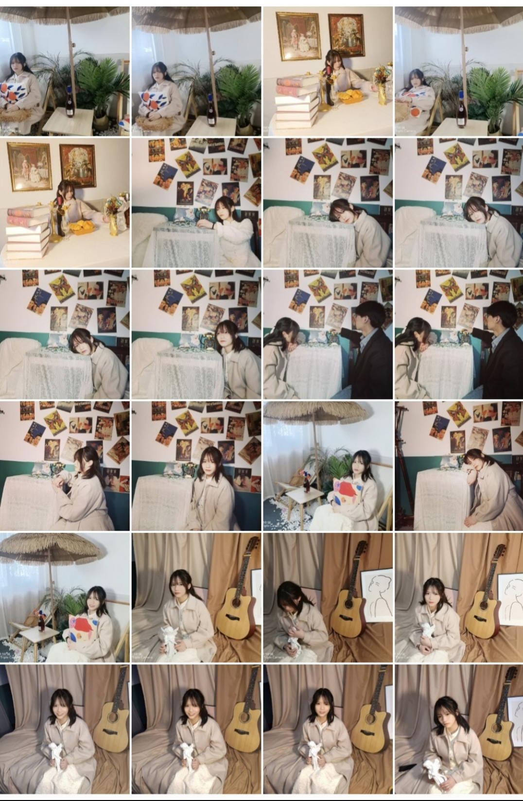

<!DOCTYPE html>
<html>
	<head>
		<meta charset="utf-8" />
	</head>
	<body>
		<a href="https://www.bilibili.com/video/BV1fz4y1Q7Zh/"><h1 align="center">“只愿君心似我心，定不负相思意，我爱岳楦。”</h1></a>
		<a href="https://www.bilibili.com/video/BV1U3411L725/"><h1 align="center"><canvas id="c"></canvas>
		<h1 align="center"><canvas id="c"></canvas>    
			
		    </h1>
		<ul>
					<a href="https://www.bilibili.com/video/BV1m64y167dd/"><li><h1 align="center">愿我如星君如月，夜夜流光相皎洁</h1></li></a>
					<a href="https://www.bilibili.com/video/BV1GM4y1M792/"><li><h1 align="center">天不老，情难绝。心似双丝网，中有千千结。</h1></li></a>
				           <ul>
							   
					        
		<ul>
								  
			
								  </ul>
								  <a href="https://www.bilibili.com/video/BV1bW4116756/">
		<h1 align="center">

			
			    

			        
			    

			
			    

			        

			            

			            

			            

			            

			        

			    

			
			

			
			

			    

			        

			        

			    

			
			

		  </style>
		 </HEAD>
		
		 <BODY>
		  <canvas id="pinkboard"></canvas>
		  </h1> 
	<h1 align="center"><a href="https://www.bilibili.com/video/BV1Fm4y1o7Z8/">【点击可见深情告白】</a></h1> 
		  <a href="https://www.bilibili.com/video/BV13Q4y1i7nm/"><h1 align="center">生当复来归，死当长相思</h1></a>
		  <a href="https://www.bilibili.com/video/BV16t4y1576B/"><h1 align="center"></h1>
		  <a href="https://www.bilibili.com/video/BV1FF411G7Ax/"><h1 align="center"></h1> 
		<a href="https://www.bilibili.com/video/BV1GS4y1N79e/"><h1 align="center"></h1>
		 
		
		<a href="https://www.bilibili.com/video/BV1ZR4y1s75N/"><h1 align="center"></h1>
	</body>
</html>

